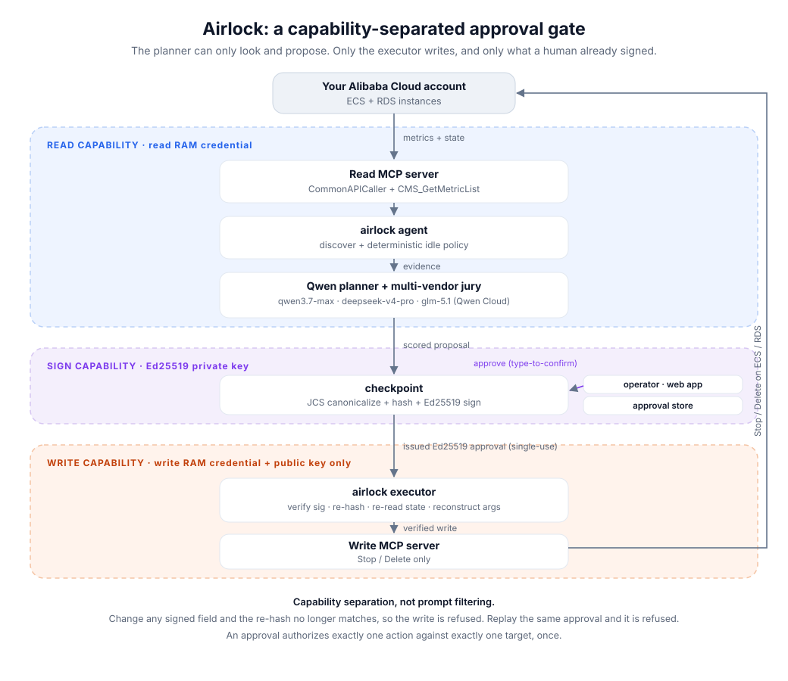
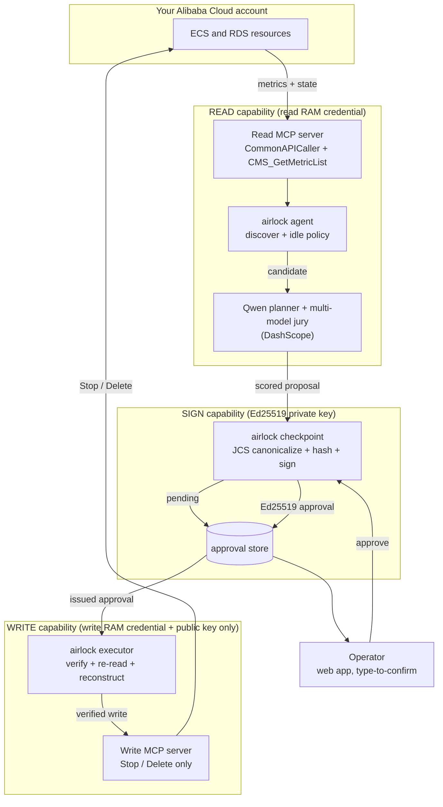

# Airlock architecture

Airlock runs a Qwen-driven cleanup agent end to end, but splits the work across four
components so that **no single component can both decide and destroy**. Each holds the least
capability it needs. The read side (with the Qwen intelligence) can only look and propose;
the write side can only execute an action a human already signed.

The same flow as maintained source (renders on GitHub):

## The flow

1. **Discover (read).** `airlock agent` lists instances and pulls a windowed CPU/mem/disk
   time series through the read MCP server (`CommonAPICaller` for discovery,
   `CMS_GetMetricList` for metrics). A deterministic idle policy decides candidacy.
2. **Reason (Qwen).** For each candidate, a Qwen planner produces the canonical action and a
   multi-model jury (heterogeneous Qwen Cloud models) scores disagreement. The score is bound
   into the proposal's evidence and surfaced to the operator; high disagreement raises the bar
   for approval.
3. **Gate (sign).** The checkpoint canonicalizes the proposal (RFC 8785 JCS), hashes it, and
   on operator approval issues an Ed25519 envelope binding that hash plus the account,
   audience, key id, a nonce, and an expiry. The operator approves in the web app with
   type-to-confirm on high-risk actions.
4. **Execute (write).** `airlock executor` picks up the issued approval, re-verifies the
   signature, re-hashes the presented action, checks account/audience/key/expiry, atomically
   consumes the approval (single use), re-reads live state against the precondition, rebuilds
   the write arguments from trusted fields, and only then calls the write MCP server.

## Trust boundaries (why it holds)

| Boundary | Holds | Never holds |
|---|---|---|
| Agent + Qwen planner/jury | read RAM credential, read MCP tools | write credential, write MCP tool, signing key |
| Checkpoint | Ed25519 **private** key | cloud credentials of any kind |
| Executor | write RAM credential, Ed25519 **public** key | private signing key |

The guarantee is enforced by capability separation, not prompt filtering. Qwen decides *what*
to propose but holds no write capability, so a wrong, adversarial, or prompt-injected model
still cannot mutate the cloud. A write happens only when the executor can verify an unexpired,
unconsumed, operator-signed approval whose hash matches the exact action presented. Change any
field after sign-off and the hash differs, so the write is refused.

Run the four components as separate processes or containers (see `docker-compose.yml`) so the
split is a deployment boundary, not just a code convention.
